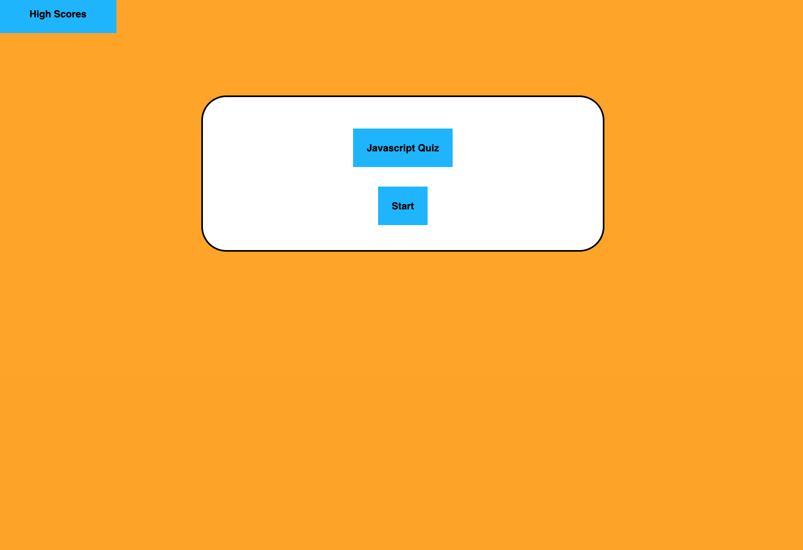
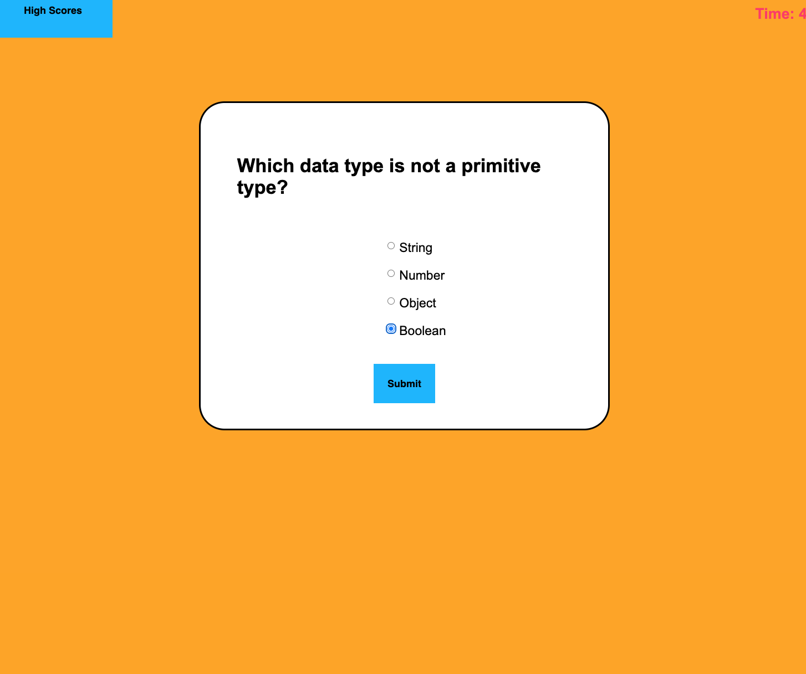
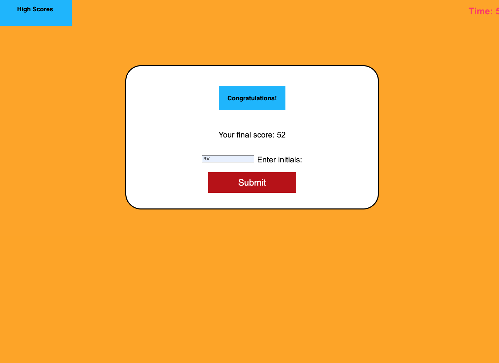

# Code-Like-A-Queen-Quiz

## Description

This application was built for coding students to to be able to familiarize themselves with tests that they will likely encounter as they are in the interview process for software developer jobs. It is a timed coding quiz with multiple choice questions. This application will run in the browser and features dynamically updated HTML and CSS powered by JavaScript code. The challenges I had were getting the colors right, having it format correctly and having the scores show up on the page. I enjoyed creating it. 

## How to Install and Use

Add the link to your browser and when the page is loaded up, you are brought to the homepage. There is a start button for the quiz, you press it and start to answer questions. There is also a button to see the high scores of the quiz. For every incorrect answer, time is subtracted from the clock. The quiz is over when all the questions are answered or the timer zeroes out. You then can save your initials and score.

## User Story

AS A coding boot camp student
I WANT to take a timed quiz on JavaScript fundamentals that stores high scores
SO THAT I can gauge my progress compared to my peers

## Acceptance Criteria

GIVEN I am taking a code quiz
WHEN I click the start button
THEN a timer starts and I am presented with a question
WHEN I answer a question
THEN I am presented with another question
WHEN I answer a question incorrectly
THEN time is subtracted from the clock
WHEN all questions are answered or the timer reaches 0
THEN the game is over
WHEN the game is over
THEN I can save my initials and my score

## Links

Deployed: http://127.0.0.1:3000/index.html
GitHub: https://github.com/spartanchick619/Code-Like-A-Queen-Quiz.git

